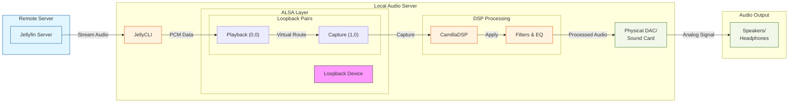

# Linux Headless Audio Processing with CamillaDSP

This guide explains how to implement Digital Signal Processing (DSP) in your HiFi processing chain using a headless Linux server, CamillaDSP, and JellyCLI.

## Table of Contents
- [System Overview](#system-overview)
- [Prerequisites](#prerequisites)
- [Linux Audio Architecture](#linux-audio-architecture)
- [Installation](#installation)
- [Configuration](#configuration)
- [Deployment](#deployment)
- [Testing](#testing)
- [Troubleshooting](#troubleshooting)

## System Overview

The setup consists of three main components:
1. ALSA Loopback Device - Virtual sound card for internal routing
2. CamillaDSP - Real-time audio processing engine
3. JellyCLI - Headless music player client for Jellyfin

The audio flow is:

JellyCLI → Loopback Device → CamillaDSP → Physical Sound Card → Speakers/DAC

## Prerequisites

- Linux system with Docker installed
- ALSA utils (`alsa-utils` package)
- Working sound card and DAC setup
- Docker and Docker Compose
- Jellyfin server
- JellyCLI configured and tested

## Linux Audio Architecture

### ALSA Layer
ALSA (Advanced Linux Sound Architecture) provides:
- Hardware abstraction
- Device enumeration
- PCM (audio) routing
- Mixer controls

### Loopback Device
1. Load the module:
```bash
sudo modprobe snd-aloop
```

2. Verify the loopback device:
```bash
aplay -l | grep Loopback
```

3. Make it persistent by adding to `/etc/modules`:
```bash
echo "snd-aloop" | sudo tee -a /etc/modules
```

## Installation

1. Clone this repository:
```bash
git clone https://github.com/bkutasi/headless-camilladsp
cd headless-camilladsp
```

2. Build CamillaDSP Docker image:
```bash
docker build -t camilladsp .
```

## Configuration

### CamillaDSP Setup

Adjust the device settings in `config.yml`:
   - Set capture device to `hw:Loopback,1,0` for ALSA loopback input
   - Configure playback device to match your DAC hardware
   - Ensure sample rates are compatible with your audio hardware
   - Configure filters and EQ settings as desired
   - Optional: Follow audio tuning guides to optimize sound quality

**NOTE:**
Make sure that the Loopback,1 device is used for capture since that is the "input" of the loopback device. You then can use the Loopback,0 device for playback which is the "output" of the loopback device.


### Audio Device Verification

1. List all audio devices:
```bash
aplay -l
arecord -l
```

2. Test loopback device:
```bash
speaker-test -D hw:Loopback,1,0 -c 2
```

## Deployment

### CamillaDSP

```bash
docker run -it --rm \
  --name camilladsp \
  --device /dev/snd:/dev/snd \
  --group-add $(getent group audio | cut -d: -f3) \
  -v /path/to/config.yml:/root/camilladsp/config.yml \
  -v /path/to/filters:/root/camilladsp/filters \
  camilladsp
```

### JellyCLI

1. Ensure you have a Jellyfin server running. You can download and install Jellyfin from [here](https://jellyfin.org/downloads/).

2. Install JellyCLI by following the instructions in the [JellyCLI repository](https://github.com/tryffel/jellycli).

3. Configure JellyCLI by creating a configuration file. You can find a sample configuration file in the JellyCLI repository.

4. Verify your soundcard is recognized by the system:

```bash
docker run -it --rm \
  --name jellycli \
  --device /dev/snd \
  --env ALSA_CARD=Loopback \
  -v ~/jellycli-config/jellycli-conf:/root/.config \
  tryffel/jellycli --no-gui
```

## Testing

1. Test audio routing:
```bash
# Play test tone to loopback device
speaker-test -D hw:Loopback,1,0 -c 2 -t sine

# Record from loopback device
arecord -D hw:Loopback,0,0 -f cd test.wav
```

2. Verify DSP processing:
```bash
# Monitor CPU usage
docker stats camilladsp

# Check CamillaDSP logs
docker logs -f camilladsp
```

3. Test end-to-end:
```bash
# Play audio file through the chain
ffplay -nodisp -autoexit -f alsa hw:Loopback,1,0 test.mp3
```

## Troubleshooting

### Common Issues

1. No Sound
- Check ALSA mixer levels: `alsamixer`
- Verify device permissions: `ls -l /dev/snd/*`
- Check Docker audio group: `groups`

2. Audio Glitches
- Increase buffer size in `config.yml`
- Check CPU usage and system load
- Verify sample rates match

3. Device Busy
```bash
# List processes using sound devices
fuser -v /dev/snd/*

# Reset ALSA
sudo alsa force-reload
```

### Debug Commands

1. ALSA configuration:
```bash
cat /proc/asound/cards
cat /proc/asound/modules
```

2. Monitor CamillaDSP:
```bash
# View detailed logs
docker logs camilladsp -f --tail 100

# Check CPU usage
top -p $(pgrep camilladsp)
```

3. Audio routing test:
```bash
# Record processed output
arecord -D hw:YourDAC,0 -f cd output.wav
```

## Contributing

For issues, improvements, or discussions, please open a ticket in the repository.

## Credits

- CamillaDSP: [HEnquist/camilladsp](https://github.com/HEnquist/camilladsp)
- JellyCLI: [tryffel/jellycli](https://github.com/tryffel/jellycli)

## System Architecture

### Audio Processing Flow



### Component Descriptions

1. **Jellyfin Server**
   - Hosts media library
   - Streams audio to JellyCLI
   - Handles metadata and library management

2. **JellyCLI**
   - Headless Jellyfin client
   - Connects to Jellyfin server
   - Outputs audio to ALSA device

3. **ALSA Loopback**
   - Virtual sound card
   - Creates internal audio routing
   - Two subdevices:
     * Playback (hw:Loopback,0,0)
     * Capture (hw:Loopback,1,0)

4. **CamillaDSP**
   - Real-time audio processing
   - Applies filters and EQ
   - Configurable pipeline

5. **Physical Output**
   - DAC/Sound card
   - Final analog conversion
   - Physical audio output

### Data Flow

1. Audio stream starts from Jellyfin server
2. JellyCLI receives and decodes the stream
3. Audio is sent to Loopback capture device
4. CamillaDSP captures from Loopback device
5. DSP processing is applied
6. Processed audio goes to physical output
7. DAC converts to analog signal
8. Sound is output through speakers